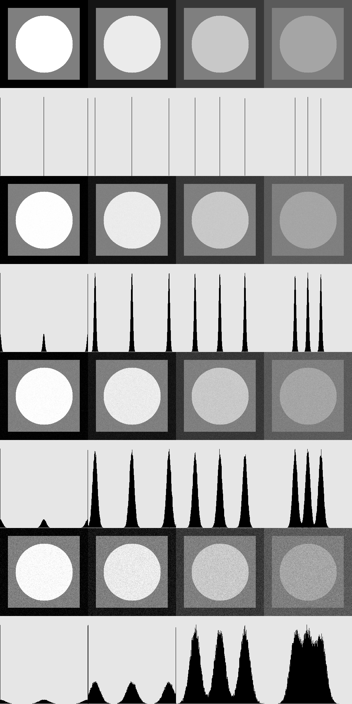

## Лабораторная 02 (гистограммы и аддитивный шум)
1. написать функцию для генерации тестового изображения с тремя уровнями яркости

	(256 - сторона изображения, 209 - сторона внутреннего квадрата, 83 - радиус круга)
2. написать функцию для рисования гистограммы яркости на квадратном растре со стороной 256 в виде столбиков шириной в 1px яркости 0 на фоне 230, нормировку сделать так, чтобы максимальное значение имело высоту 230
3. написать функцию зашумления (аддитивный нормальный несмещенный шум с заданным значением среднеквадратичного отклонения)
4. сгенерировать тестовые изображения для 4-х наборов уровней и склеить слева-направо

	[0,127,255]

	[20,127,235]

	[55,127,200]

	[90,127,165]
5. сгенерировать зашумленные изображения и гистограммы, которые размещаются встык ниже тестового изображения
6. зашумление сделать для трех значений среднеквадратичного отклонения 3, 7, 15
7. склеить все изображения в одно
8. исследовать параметры шума в областях равной яркости
[README.md](README.md)
## Функциональность

- generateTestImage:

  - Эта функция создает тестовое изображение размером 256x256 пикселей и заполняет его геометрическими фигурами.
  - Принимает три параметра intensive1, intensive2, intensive3, которые задают интенсивности для прямоугольников и круга.
  - Сначала создается матрица изображения image с черным фоном.
  - Затем на изображение накладываются три фигуры: прямоугольник, прямоугольник с отступом и круг.
  - Функция возвращает полученное тестовое изображение.

- drawHistogram:

  - Эта функция создает гистограмму для переданного изображения image.
  - Создается фоновое изображение background размером 256x256 пикселей с серым цветом.
  - Далее вычисляется гистограмма для изображения image с использованием OpenCV функции cv::calcHist.
  - Гистограмма нормализуется и отрисовывается на фоновом изображении background в виде столбиков.
  - Функция возвращает изображение с нарисованной гистограммой.
- addNoise:

  - Эта функция добавляет шум к изображению с помощью алгоритма Box-Muller.
  - Принимает изображение image и стандартное отклонение stddev.
  - Создается копия изображения cloneImage.
  - Для каждого пикселя изображения генерируются два случайных числа u и v в диапазоне [0, 1].
  - По формуле алгоритма Box-Muller вычисляется случайное число rand_numb_box_muller.
  - Это число добавляется к интенсивности пикселя с учетом стандартного отклонения stddev.
  - Функция возвращает изображение с добавленным шумом.

## Запуск приложения

Скомпилируйте исходный код и запустите исполняемый файл.

```bash
./lab02

```

## Готовое фото
