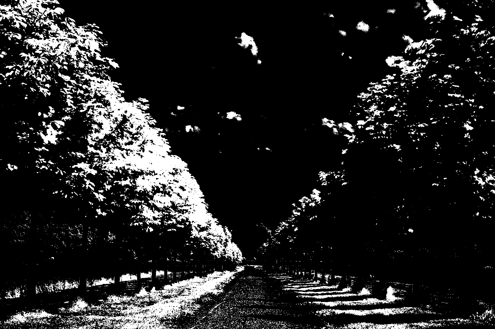
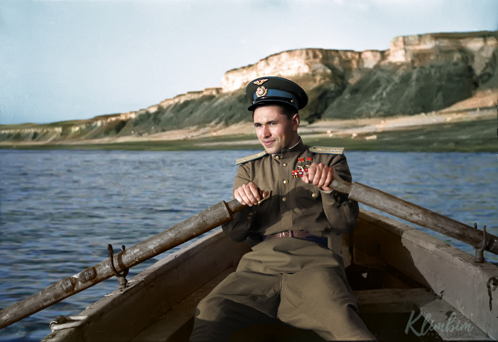
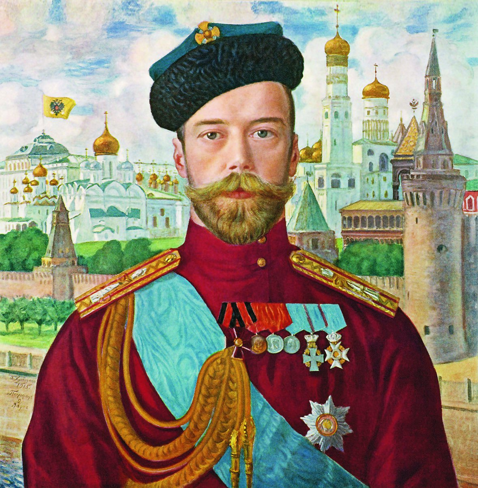
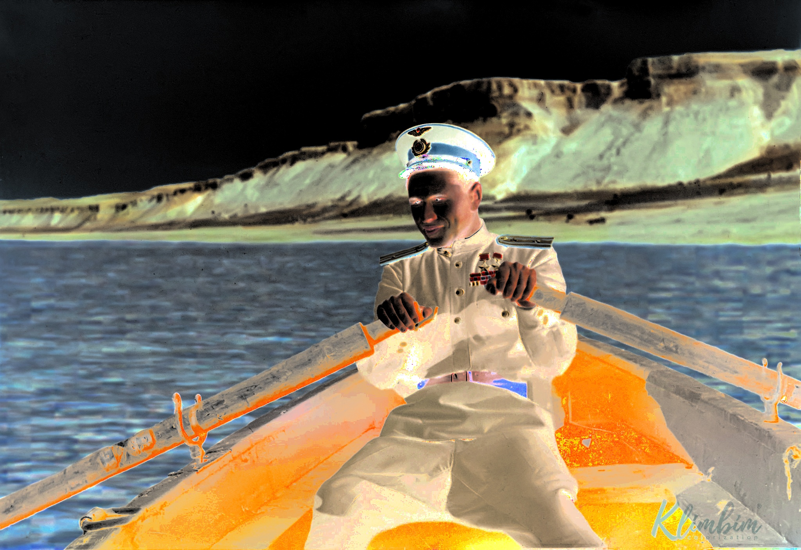

Лабораторная 03 (автоконтраст)
====================================================
1. написать функцию для автоконтрастирования по квантилям черного и белого
2. написать функции для автоконтрастирования цветного изображения (поканально и совместно)
3. оформить в виде консольного приложения (тип входного изображения определять автоматически)
4. подобрать тестовые изображения
5. написать короткий отчет


# Автоконтраст

### Использование

Приложение принимает аргументы командной строки для указания пути к входному изображению, нижнего квантиля, верхнего квантиля и метода автоматической коррекции контраста. Вот доступные опции:

```
Использование:
  ./lab03 [опции] @image

Опции:
  -h, --help                        Вывести это сообщение
  -l, --lowerQuantile <значение>    Нижний квантиль для автоматической коррекции контраста (по умолчанию: 0.02)
  -m, --autoContrastMethod <метод>  Метод автоматической коррекции контраста (perChannel или combined) (по умолчанию: combined)

```

### Функциональность

Автоматическая коррекция по квантилям: Корректирует контраст полутоновых изображений на основе заданных нижнего и верхнего квантилей.

Автоматическая коррекция для цветных изображений:
- По каналам: Корректирует контраст цветных изображений независимо для каждого цветового канала.
- Совместно: Корректирует контраст цветных изображений, учитывая все каналы одновременно.

## Запуск приложения

Скомпилируйте исходный код и запустите исполняемый файл с необходимыми аргументами командной строки, чтобы применить автоматическую коррекцию контраста к входному изображению.

```bash
./lab03 --lowerQuantile=0.02 --autoContrastMethod=combined ../prj.lab/lab01/images/lab03_1_channel.jpeg

```

## Примеры работ

| Черно-белое изображение                          |                                                        |  |
|--------------------------------------------------|--------------------------------------------------------|--|
|  |  |  |
| *Оригинал*                                       | *1%*                                                   | *10%* |

| Цветное, по каналам                                                                           |                                                                                                   |                                                                                                                 |
|-----------------------------------------------------------------------------------------------|---------------------------------------------------------------------------------------------------|-----------------------------------------------------------------------------------------------------------------|
|   |    |   |
| *Оригинал*                                                                                    | *1%*                                                                                              | *10%*                                                                                                           |

| Цветное, совместно                                                                                        |                                                                                                                |
|-----------------------------------------------------------------------------------------------------------|----------------------------------------------------------------------------------------------------------------|
|   |    |
| *1%*                                                                                                      | *10%*                                                                                                          |

