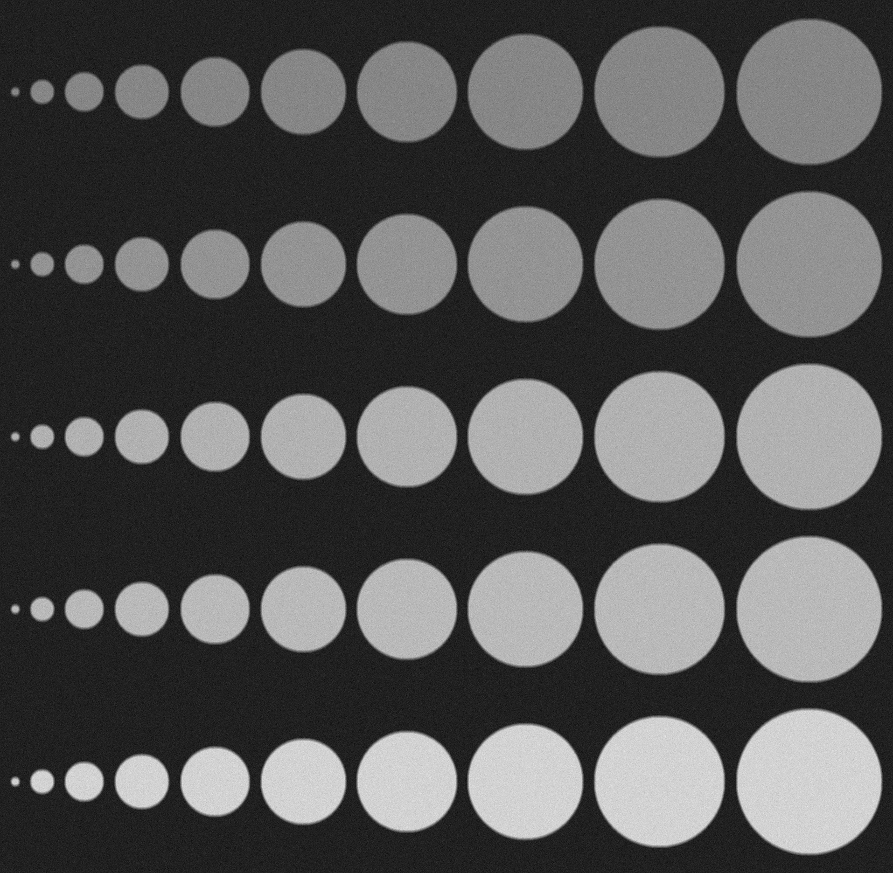
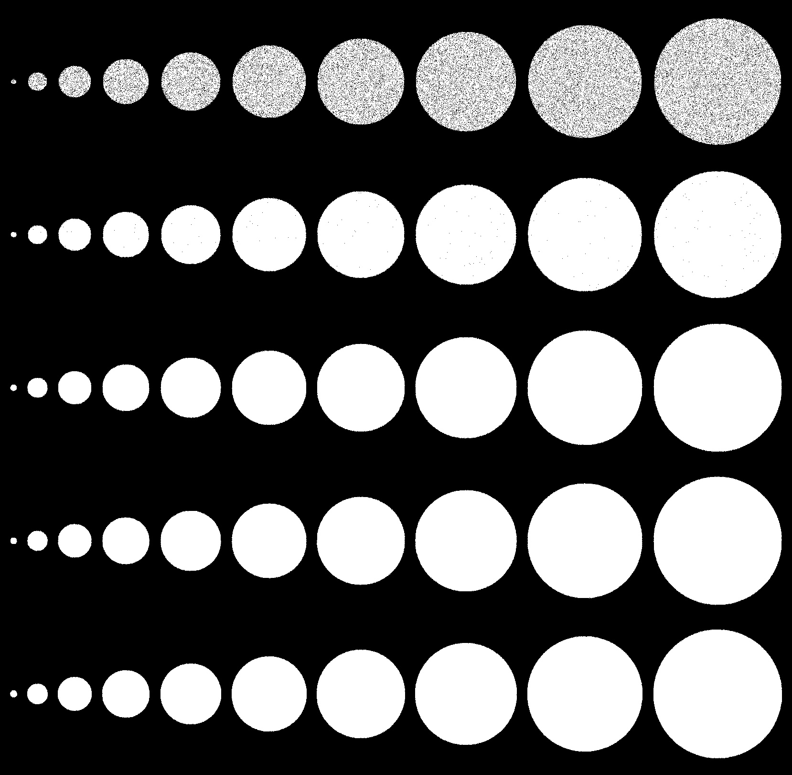
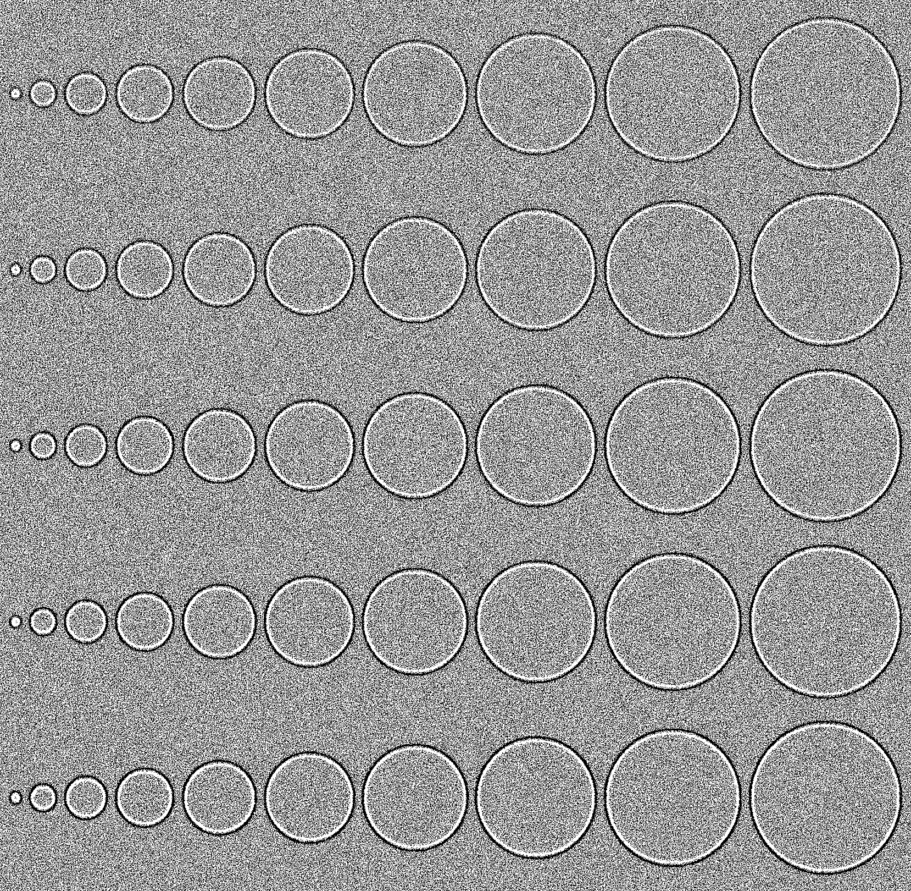
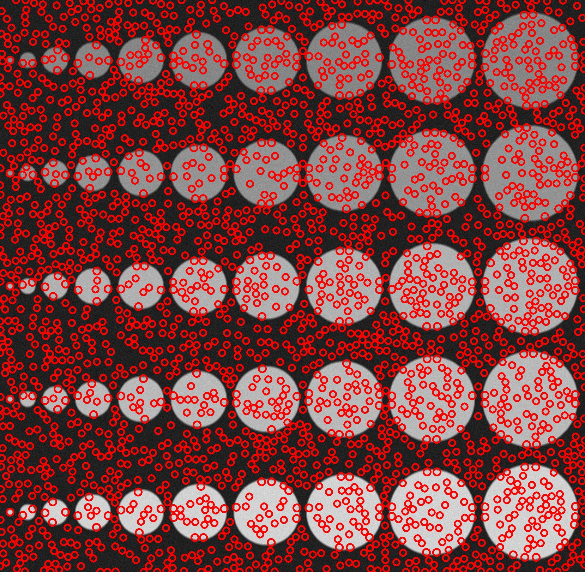
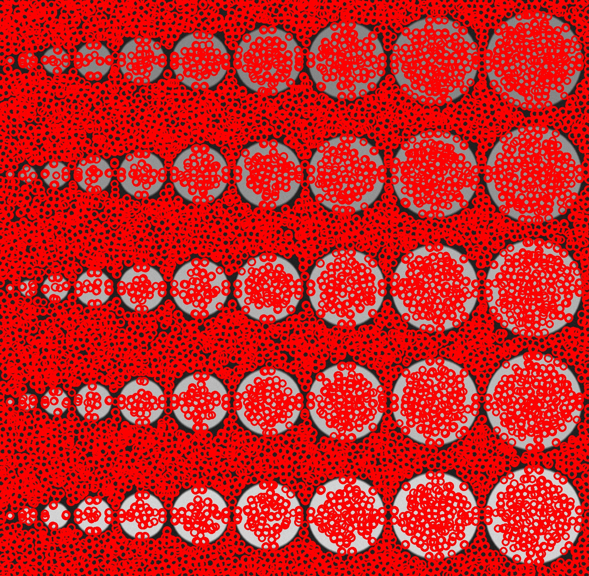

## Лабораторная 04 (бинаризация и простое детектирование объектов)

1. написать функцию для генерации тестового изображения (количество объектов интереса, диапазон размеров, значений контраста и степени размытости - параметры)
2. написать несколько вариантов бинаризации (параметризованной)
3. предусмотреть режим визуальной настройки параметров бинаризации (движки в GUI)
4. написать функционал для детектирования
5. написать функционал для оценки качества (на основе IoU при заданном уровне сделать подсчет количества TP, FP и FN детекций)

## Функциональность

## Цель
Изучить методы бинаризации и простые методы детекции, научиться оценивать качество работы алгоритмов.


## Запуск приложения

Скомпилируйте исходный код и запустите исполняемый файл.

```bash
./lab04
```

##  Этапы работы:

### 1. Генерация исходного изображения
Пример исходного изображения:


Применим к изображению шум:


### 2. Бинаризация
- Пороговая бинаризация (Эта бинаризация применяется функцией thresholdBinary. Она использует фиксированное пороговое значение для преобразования изображения в двоичное)
  

- Адаптивная пороговая бинаризация (Она использует адаптивный алгоритм для определения порога для каждой небольшой области изображения)
  

### 3. Детекция (проходит в два основных этапа детектирования)

- Это изображение создается и отображается во время этапа применения фильтра Лапласиана Гауссиана (LoG) для выявления локальных максимумов. На каждом уровне пирамиды изображения применяется LoG фильтр с различными значениями сигмы для нахождения блобов разного размера.
  

- Это изображение отображается после завершения всех этапов детектирования, включая нахождение локальных максимумов, создание маски компонент и фильтрацию пересекающихся объектов. Оно отображает конечный результат детекции с выделенными красными кругами вокруг обнаруженных объектов (блобов).
  


