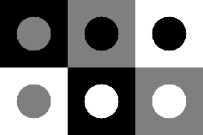
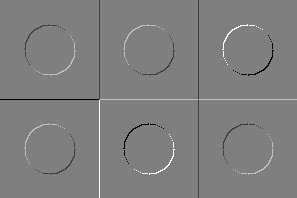
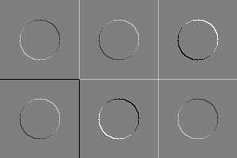
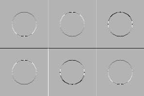
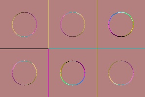

## Лабораторная 05 (фильтрация)
1. написать функцию для генерирования всех вариантов круга на фоне квадрата (для уровней серого 0, 127, 255)
   размер квадрата - 99, радиус круга - 25, круг в центре квадрата
   квадраты образуют прямоугольник (3 столбца, 2 строки)  
     
   ***примерный результат***
     
   


2. задать "руками" два ядра для линейной фильтрации
   [+1 0  0 -1]   и  [-1  0 0 +1]
3. получить изображения I1 и I2 линейной фильтрацией с указанными ядрами
4. получить изображение I3 = sqrt(I1^2 + I2^2)
5. получить RGB изображение для визуализации, поместив в каналы I1,I2 и I3
6. написать отчет


## Функциональность

1. Генерация тестового изображения:
- Создание тестового изображения с помощью функции testImage()
2. Линейная фильтрация:
- Применение линейной фильтрации к этому изображению с двумя заданными ядрами:
  - Первое ядро kernel [+1 0; 0 -1] используется для выделения горизонтальных границ.
  - Второе ядро kernelTran [0 1; -1 0] используется для выделения вертикальных границ.
3. Создание изображения I3:
- Создание изображения I3, в котором каждый пиксель представляет собой квадратный корень из суммы квадратов значений пикселей, полученных в результате горизонтальной и вертикальной фильтрации.
4. Создание RGB изображения для визуализации:
- Создание трехканального RGB изображение, в котором каждый канал соответствует результатам горизонтальной фильтрации (красный канал), вертикальной фильтрации (зеленый канал) и комбинированной фильтрации (синий канал).
5. Отображение результатов:
- Все созданные изображения отображаются в окнах с помощью функции cv::imshow()
6. Сохранение результатов в файлы:
- Исходное изображение и итоговое RGB изображение сохраняются в файлах "lab05_start.jpg" и "lab05_end.jpg" соответственно с помощью функции

## Запуск приложения

Скомпилируйте исходный код и запустите исполняемый файл.

```bash
./lab05

```

## Показ поэтапных изображений

| Исходное изображение                                             | Линейная фильтрация (горизонтальные границы)                | Линейная фильтрация (вертикальные границы)                     | Комбинированная фильтрация                                            | RGB изображение                                   |
|------------------------------------------------------------------|-------------------------------------------------------------|----------------------------------------------------------------|-----------------------------------------------------------------------|---------------------------------------------------|
|  |  |  |  |  |
