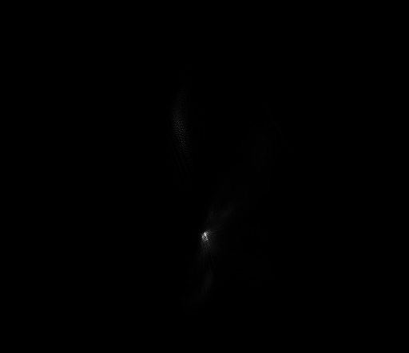

## Лабораторная 08 (визуализация цветового распреления)
Написать консольное приложение для визуализации плотности цветового распределения в linRGB


### Использование

Приложение принимает аргументы командной строки для указания пути для исходного изображения, и изображения, которое нужно сохранить.

```
Использование:
  ./lab08 [опции] @image

Опции:
    --input <путь> 
    --output <путь>
    --size <размер изображения>

```

### Функциональность
- Нормализация вектора (Функция normalize нормализует вектор в пространстве RGB.)
  
- Проекция цветов из изображения (Функция projectColors проецирует каждый пиксель из входного изображения в 2D пространство с использованием заданных осей проекции.)

- Проекция всех возможных цветов (Функция projectAllColors создает проекцию всех возможных цветов в пространстве RGB.) 

### Запуск приложения

Скомпилируйте исходный код и запустите исполняемый файл с необходимыми аргументами командной строки, чтобы применить автоматическую коррекцию контраста к входному изображению.

```bash
 ./lab08 --input=../prj.lab/lab01/images/rgbt.png --output=../prj.lab/lab01/images/rgbt2.png --size=512
```

## Примеры работ

1. Первое фото~~~~

 

2. Второе фото

 

3. Третье фото

 


